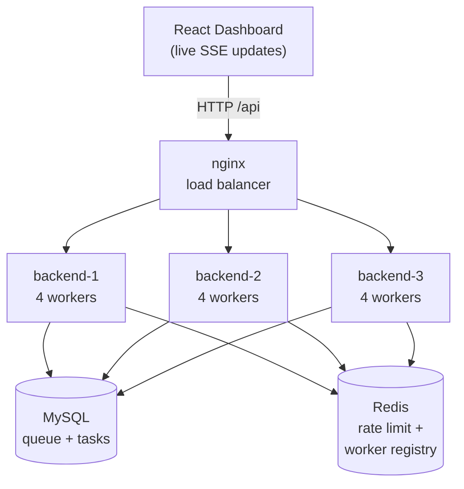

# Task Execution Engine — Distributed Background Job Processing System

> A from-scratch **distributed background job engine** in Go: clients submit tasks over an API, they
> live in a MySQL table that *is* the queue, a pool of worker goroutines across **multiple
> load-balanced instances** claims and runs them concurrently with `SELECT ... FOR UPDATE SKIP LOCKED`
> (so no job ever runs twice), failures retry and then dead-letter, a Deficit-Round-Robin scheduler
> keeps tenants fair, and a **React dashboard streams it all live over SSE**.

*Built as a backend / distributed-systems portfolio piece. The task handlers are simulated (sleep +
random pass/fail) — the value is the **reusable engine**: queuing, scheduling, fault tolerance,
rate limiting, real-time tracking, and horizontal scaling.*

---

## ✨ Highlights

- **Concurrent worker pool** in Go (goroutines + bounded channels) with graceful shutdown.
- **Database-as-queue** with `SKIP LOCKED` → concurrency-safe dequeue, **zero double-processing**, no app-level locks.
- **Horizontally scalable** — run N identical instances sharing one MySQL + Redis; **zero coordination code**.
- **Fault tolerant** — three independent recovery layers (startup recovery + graceful drain + hung-worker watchdog) → **zero task loss** across crashes.
- **Fair multi-tenant scheduling** (Deficit Round Robin) — no client starvation under skewed load.
- **Cost-weighted rate limiting** (Redis sliding window, atomic Lua, weighted by batch size).
- **Real-time** task updates over **Server-Sent Events**; live **worker registry** across all instances (Redis heartbeat + TTL).
- **Full dashboard** (React + TypeScript + Mantine): live workers, task table + filters + drill-down, analytics, per-type breakdown.
- **Dockerized** — `docker compose up` runs the whole distributed stack (3 backends + nginx LB + MySQL + Redis).

## 📊 Performance (measured — see [`docs/BENCHMARKS.md`](docs/BENCHMARKS.md))

| Metric | Result |
|---|---|
| Throughput (3 instances / 12 workers) | **~4.6 tasks/sec** |
| Scaling factor (1 → 3 instances) | **~2.5×** (~85% of perfect linear) |
| Avg execution latency | **~1.8 s** (pure handler time) |
| Queue-wait relief (4 → 12 workers) | **53.7 s → 19.0 s** |
| Task loss across forced crashes | **0** |

*Measured with the Go load tool in [`bench/`](bench); full reproducible methodology in the benchmarks doc.*

## 🏗️ Architecture



- The **MySQL table is the queue**; every instance's workers claim distinct rows via `SKIP LOCKED`.
- **Redis** holds shared, ephemeral state: the cost-weighted rate limiter and the live worker registry (each instance heartbeats its worker state; dead instances expire via TTL).
- **nginx** load-balances the API and serves the React app (same origin → no CORS).
- The instances **never talk to each other** — they coordinate entirely through shared MySQL + Redis.

## 🚀 Quick start

**Everything in one command** (needs Docker Desktop running):

```bash
git clone <repo> && cd task-execution-engine
docker compose up --build
```
Then open **http://localhost:8080** — the dashboard, 3 backend instances, MySQL, Redis, and nginx all
running in containers. Hit **"Demo data"** to watch tasks flow across all 12 workers.

<details>
<summary>Local dev (without Docker)</summary>

```bash
# needs local MySQL + Redis (e.g. `brew services start mysql redis`)
cd backend && go build -o task-engine . && LOG_FORMAT=text ./task-engine   # API on :8080
cd frontend && npm install && npm run dev                                   # dashboard on :5173
```
Run more instances: `INSTANCE_ID=backend-2 PORT=8081 ./task-engine` (shares the same DB/Redis).
</details>

## 🧰 Tech stack

| Layer | Tech | Why |
|---|---|---|
| Backend | **Go** (goroutines, channels) | Concurrency is the heart of the project |
| HTTP | **Gin** | Lightweight router |
| Queue + data | **MySQL** (`SKIP LOCKED`) | The DB *is* the queue; concurrency-safe dequeue |
| Shared state | **Redis** | Rate limiter + worker registry, shared across instances |
| Frontend | **React + TypeScript + Mantine** | Clean, responsive dashboard |
| Charts | **Recharts** (via @mantine/charts) | Live analytics |
| Real-time | **SSE** | One-way server→browser push |
| Infra | **Docker Compose + nginx** | One sealed, load-balanced stack |

**Deliberately *not* used:** Kafka (a DB-backed queue is simpler and sufficient) and WebSockets (data
flows one way → SSE). Knowing what *not* to add is part of the design.

## 🔌 API (13 endpoints + 1 SSE stream)

```
POST /api/tasks              POST /api/tasks/batch        GET  /api/tasks (filters, pagination, ?all)
GET  /api/tasks/:id          POST /api/tasks/:id/cancel
GET  /api/analytics          GET  /api/analytics/throughput   GET /api/analytics/types
GET  /api/workers            GET  /api/sse/events (stream)    GET /api/health
POST /api/demo/seed          POST /api/demo/clear
```
All task endpoints are API-key authed and tenant-scoped; submission is rate-limited (cost-weighted).

## 📁 Project structure

```
backend/    Go service — config, models, services, controllers, middleware, routes,
            worker (pool + registry), scheduler (DRR), watchdog, ratelimit, sse, logger
frontend/   React + TS + Mantine dashboard (Dashboard / Tasks / Analytics / Task Types)
bench/      Go load-test tool
docs/       Design docs + INTERVIEW-NOTES, STUDY-GUIDE, BENCHMARKS, DEV-TOOLKIT, LOG-TIPS
docker-compose.yml   the full distributed stack
```

## 📚 Documentation

| Doc | What's in it |
|---|---|
| [BENCHMARKS](docs/BENCHMARKS.md) | Measured metrics + reproducible methodology |
| [INTERVIEW-NOTES](docs/INTERVIEW-NOTES.md) | Every problem solved → how → "the line you say" + follow-ups |
| [STUDY-GUIDE](docs/STUDY-GUIDE.md) | System-design topics to revise, mapped to what's built |
| [DEV-TOOLKIT](docs/DEV-TOOLKIT.md) / [LOG-TIPS](docs/LOG-TIPS.md) | How to run, inspect, and debug it |
| [ROADMAP](docs/07-ROADMAP.md) | Phase-by-phase build log |
| [01](docs/01-ARCHITECTURE.md)–[10](docs/10-ENGINEERING-GUIDE.md) | Original design docs (architecture, DB, backend, frontend, hosting, engineering guide) |

---

*~2,800 lines of Go (14 packages) + ~1,200 lines of TypeScript. Built phase-by-phase to be understood
and defended, not just shipped.*
